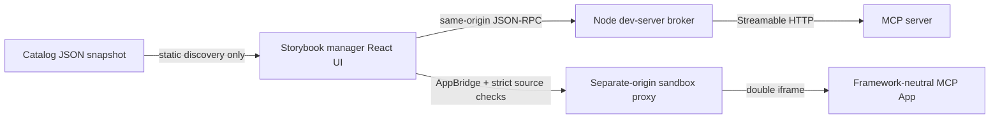

# Storybook MCP DevTools

Storybook developer tools for browsing Model Context Protocol (MCP) tools, invoking them with explicit human approval, inspecting complete results, and developing [MCP Apps](https://github.com/modelcontextprotocol/ext-apps).

[View the static Storybook demo](https://krubenok.github.io/storybook-addon-mcp-devtools/). It uses the checked-in catalog snapshot, so tool calls and MCP App execution are intentionally disabled.

This addon is complementary to Storybook's official [`@storybook/addon-mcp`](https://github.com/storybookjs/storybook/tree/next/code/addons/mcp). The official addon exposes a Storybook as an MCP server. This project is an MCP **client and Apps development host** inside Storybook.

> [!IMPORTANT]
> This is an early development tool, not a hardened production host. The included App sandbox demonstrates the stable MCP Apps double-iframe architecture on separate localhost origins. Deployments must provide and audit their own dedicated sandbox origin, CSP headers, host-origin allowlist, and operational controls.

## MVP capabilities

- Full-width manager tab with search, paginated `tools/list`, schemas, annotations, and MCP App metadata
- JSON Schema-backed argument validation and an explicit **Call tool** action
- Complete `structuredContent`, content block, `isError`, protocol error, and elapsed-time inspection
- Stable `_meta.ui.resourceUri` detection with deprecated `_meta["ui/resourceUri"]` tolerance
- `resources/read` and `text/html;profile=mcp-app` validation
- Public `@modelcontextprotocol/ext-apps` `AppBridge`/`PostMessageTransport` host integration
- Separate-origin sandbox proxy with restrictive CSP, permission allowlisting, strict message source/origin checks, and lifecycle cleanup
- Node-side Storybook broker so endpoint details and credentials do not enter the manager bundle
- Protocol-native catalog snapshots for useful static Storybooks
- `parameters.mcp.tools` and `parameters.mcp.resourceUri` story associations

## Quick start

The repository uses [Vite+](https://viteplus.dev/) (`vp`) as its unified package manager, formatter (Oxfmt), linter/type checker (Oxlint), test runner (Vitest), and package builder (tsdown).

```bash
curl -fsSL https://vite.plus | bash
vp install
vp run sample
```

Open <http://localhost:6006>, select **MCP DevTools**, call `increment-counter`, and inspect its Web Component App. The one command starts:

- Storybook on `http://localhost:6006`
- the Streamable HTTP sample MCP server on `http://127.0.0.1:6123/mcp`
- the separate-origin sandbox proxy on `http://127.0.0.1:6124/sandbox.html`

The sample tools and App are original, dependency-free examples built from public MCP and MCP Apps specifications.

## Addon configuration

Build the package, then add it to `.storybook/main.ts`:

```ts
import type { StorybookConfig } from '@storybook/react-vite';

const config: StorybookConfig = {
  addons: [
    {
      name: 'storybook-addon-mcp-devtools',
      options: {
        endpoint: process.env.MCP_ENDPOINT,
        headers: process.env.MCP_TOKEN
          ? { authorization: `Bearer ${process.env.MCP_TOKEN}` }
          : undefined,
        sandboxUrl: 'https://mcp-app-sandbox.example.test/sandbox.html',
        snapshotUrl: './mcp-catalog/catalog.json',
      },
    },
  ],
  staticDirs: [{ from: '../mcp-catalog', to: '/mcp-catalog' }],
  framework: '@storybook/react-vite',
};

export default config;
```

`endpoint` and `headers` are consumed only by the Node-side development broker. Only `brokerPath`, `snapshotUrl`, and `sandboxUrl` are serialized into the manager page. Do not put credentials in client-visible Storybook environment variables or commit them.

Streamable HTTP is the only live transport in this MVP. The session adapter is isolated so stdio and OAuth can be added without coupling the protocol core to React or Storybook.

## Story associations

```ts
export const Counter: Story = {
  parameters: {
    mcp: {
      tools: ['increment-counter'],
      resourceUri: 'ui://example/counter',
    },
  },
};
```

Associations are metadata only. They never trigger a tool call.

## Catalog snapshots

Capture a server's identity, capabilities, all paginated tools, schemas, annotations, and MCP App resource metadata:

```bash
vp pack
MCP_DEVTOOLS_AUTHORIZATION='Bearer …' \
  vp exec mcp-devtools-snapshot \
  --endpoint https://mcp.example.test/mcp \
  --output mcp-catalog/catalog.json
```

The authorization environment variable is optional and is never written to the snapshot. A static Storybook loads `snapshotUrl`; discovery remains available while calls and App execution stay disabled. The checked-in sample snapshot demonstrates this mode without generating one MDX page per tool.

## Architecture



The framework-neutral modules under `src/catalog.ts`, `src/result.ts`, `src/security.ts`, and `src/mcp-session.ts` do not depend on React. Hosted Apps can use Web Components, vanilla DOM, or any UI framework. React is limited to Storybook's manager tab.

Version-sensitive MCP SDK, MCP Apps, and Storybook preset behavior is kept behind `McpSession`, `BrokerTransport`, `app-host`, and `preset` modules.

## Capability matrix

| Capability                  | Storybook dev with endpoint            | Static Storybook with snapshot |
| --------------------------- | -------------------------------------- | ------------------------------ |
| Search and inspect tools    | Yes                                    | Yes                            |
| Paginated live `tools/list` | Yes                                    | No; captured data              |
| Explicit `tools/call`       | Yes                                    | Disabled                       |
| `resources/read`            | Yes                                    | Metadata only                  |
| MCP App preview             | Yes, only with separate-origin sandbox | Disabled                       |
| Server-side headers         | Yes, broker only                       | Not applicable                 |
| Streamable HTTP             | Yes                                    | No                             |
| stdio / OAuth               | Roadmap                                | Not applicable                 |

## Security model

- Tool descriptions and annotations are untrusted hints. Manager calls always show arguments and require a user click.
- App-initiated calls are limited to App-visible tools and require confirmation that shows the exact tool name and arguments.
- The manager never receives the configured endpoint headers.
- The broker rejects cross-origin, non-JSON, and session-tokenless protocol requests.
- App HTML is never rendered directly on the Storybook origin.
- The sandbox and Storybook host must have different origins.
- The outer sandbox validates `document.referrer`, parent `event.origin`, and `event.source`.
- The inner App has an opaque origin without `allow-same-origin`; the relay validates its exact `contentWindow` and the opaque origin.
- Resource CSP metadata is converted to a restrictive response header. Undeclared network, frame, and object sources are blocked.
- Camera, microphone, geolocation, and clipboard write are the only recognized permission requests.
- AppBridge is closed and the iframe is torn down when the preview unmounts.

The localhost sandbox server is a development reference, not a production security boundary. A production deployment needs a dedicated origin and a host allowlist appropriate to that deployment. See [SECURITY.md](SECURITY.md).

## Development

```bash
vp install
vp check
vp test
vp pack
vp run storybook:build
```

Vite+ 0.2.8 is pinned because it is the newest version currently available through the package feed used by this development environment. Contributors can use a newer compatible release once it is available in their registry.

## Roadmap

- OAuth authorization-code and protected-resource discovery
- Node-side stdio transport
- Persistent connection profiles and multiple servers
- Richer schema-generated controls alongside the JSON editor
- Production sandbox deployment package and conformance tests
- Tool/resource change notifications and cancellation UX

See [CONTRIBUTING.md](CONTRIBUTING.md) for development and pull request guidance.
